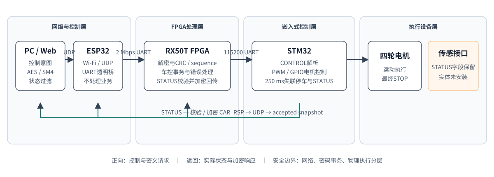

# Secure Wireless Control System on FPGA and Embedded Platforms

本仓库是“面向IoT边缘节点的GALS异步安全加速网关设计”的脱敏项目展示页。作品参加第十届全国大学生集成电路创新创业大赛“Robei”企业命题，获华中分赛区二等奖。

## 系统目标

项目以四轮小车为真实执行载体，将网络接入、密码处理与物理运动执行分层：

`PC/Web → Wi-Fi/UDP → ESP32透明桥 → UART → FPGA安全事务层 → UART → STM32 → 电机`

返回方向由STM32生成STATUS，FPGA校验并加密为CAR_RSP，经ESP32返回PC。PC仅在来源、长度、opcode、解密、CRC和sequence全部正确时更新已确认状态。

## 主要工程工作

- 需求拆解、总体架构、职责边界与接口协议；
- PC、ESP32、FPGA、STM32四节点双向链路集成；
- 基于开源AES/SM4参考核心完成FPGA接口适配和车控事务集成；
- STM32 PWM/GPIO电机控制、STATUS生成和失联物理停车；
- 软件、RTL、综合实现和真实硬件分层测试；
- Git提交、固件与bitstream SHA256、构建报告和JSONL日志追溯。

## 证据边界

本展示仓库不包含真实密钥、Wi-Fi凭据、授权令牌、个人联系方式、完整固件或未脱敏原始日志。完整源码和原始测试材料可在合适场景下线下展示。

密码核心来自开源参考实现；项目贡献集中在接口适配、事务控制、系统集成、故障定位与验证，不将其表述为个人从零设计密码算法核心。

超声波实体未安装，只完成接口、冻结向量和软件/RTL模拟验证，不声明真实距离测量通过。

## Documents

- [Evidence summary](EVIDENCE.md)
- [Architecture source](architecture.mmd)

