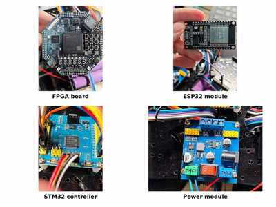

# 硬件平台说明

## 概览

系统采用多节点软硬件协同架构，由无线通信、FPGA事务处理、嵌入式执行和独立供电四部分组成。硬件选型的重点不是单板功能堆叠，而是让每个节点承担清晰、可验证的职责。



上图依次展示 FPGA开发板、ESP32通信模块、STM32控制板和电源模块。照片经过缩放和拼接，仅用于公开项目记录。

## FPGA处理平台

- **开发板**：Robei Artix-7 FPGA开发板；
- **器件**：Xilinx Artix-7 XC7A50T，封装/速度等级为 `fgg484-1`；
- **主要职责**：
  - UART帧接收与发送；
  - AES/SM4参考核心接口适配；
  - 操作码、CRC和序列号检查；
  - 车控事务管理和异常处理；
  - STM32状态校验与加密响应生成。

FPGA位于网络通信与物理执行之间，用于保证控制请求在进入执行端之前完成必要的密码和协议检查。

## ESP32通信模块

- **模块**：ESP32-WROOM开发板；
- **网络接口**：Wi-Fi / UDP；
- **设备接口**：UART；
- **主要职责**：
  - 连接无线网络；
  - 接收PC端UDP数据报并转发到FPGA；
  - 将FPGA返回的数据流封装为UDP数据报发送给PC；
  - 保持透明桥接，不维护独立的车控业务状态。

透明桥接的设计可以减少网络层与安全事务层之间的状态复制，便于分段测试和故障定位。

## STM32控制模块

- **控制器**：STM32F103；
- **主要职责**：
  - 解析FPGA下发的控制帧；
  - 通过PWM和GPIO控制电机；
  - 生成设备实际状态并回传；
  - 监测通信超时并执行失联停车；
  - 在异常路径中将最终PWM置零。

STM32是物理执行的最终责任节点。即使上游网络或安全事务链路失效，执行端仍需能够进入安全状态。

## 电机与供电

移动平台使用四轮底盘和独立电源模块。电机负载和数字逻辑的供电波动可能影响通信与控制稳定性，因此硬件联调时将以下问题单独检查：

- 电机启动和换向时的供电压降；
- FPGA、ESP32和STM32之间的共地；
- 各节点逻辑电平与串口接线；
- 电源模块输入、输出和开关状态；
- 供电异常是否会触发复位或错误停车。

本仓库中的电源照片用于说明实物平台组成，不代表已经公开完整电气设计或接线表。

## 接口关系

```text
PC控制端
   │ Wi-Fi / UDP
ESP32
   │ UART（与FPGA通信）
FPGA
   │ UART CONTROL / STATUS
STM32
   │ PWM / GPIO
电机与执行机构
```

状态沿相反方向返回：STM32生成STATUS，FPGA完成校验和响应处理，ESP32负责网络转发，PC完成最终解密与状态确认。

## 公开范围

- 硬件照片不包含密钥、网络凭据或授权信息；
- 不公开完整固件、bitstream和未脱敏原始日志；
- 超声波接口仅完成预留和软件/RTL验证，实体传感器未安装；
- FPGA背面照片信息增量较小，未放入首页概览；原始照片可在需要时作为补充材料展示。
